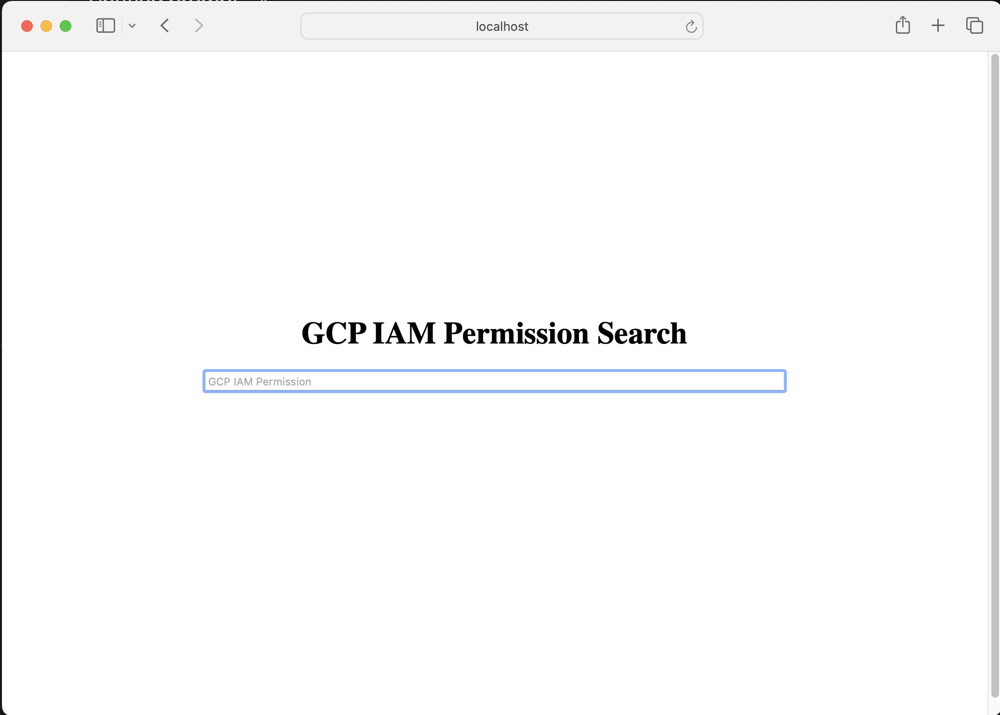
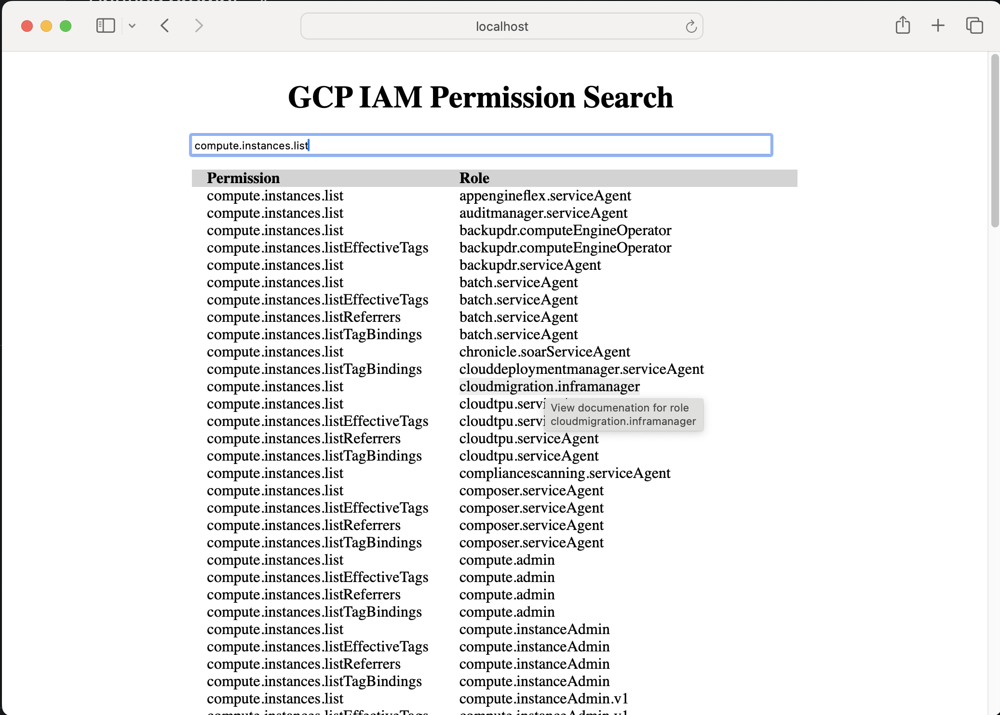

# GCP IAM Permissions Search

Use the tool to create and query a sqlite database containing a mapping of the 
GCP IAM permissions to roles.  Useful when you get an error message stating
that you need a specific GCP IAM permission and do not know which roles contain
the permission.

# Usage

First you need to create a sqlite database containing the mapping.  Then you can query
it using the commandline or via a web interface.

## Create local database

Create the sqlite database as follows:


```
gcp_iam_map maker
```

Now you have a iam.db file.


## Web usage

By default port 3000 is used to serve.
```
./gcp_iam_map serve
```

Here's the query page:



Example results:



## Commandline query

Query for roles as follows:

```
./gcp_iam_map query compute.instances.listR
```

## Additional help.

The commandline tool supports ```--help``` to find all available commands and options.

For issues, please file an issue [here](https://github.com/google/gcp_iam_map/issues).